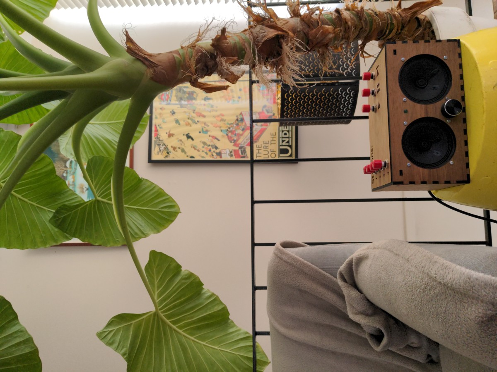

# Florence Player
*by the [Florence Project](https://itee.uq.edu.au/florence)*

A simple to operate player as part of the Florence Project.
Designed for use by people with dementia, and for construction by men's sheds and families.

[See the full build instructions here.](https://uq-flor-pro.github.io/mopidy-florence-player)

## Features:

- Four station switches programmable by web interface
- Drag and drop file-upload over local network via web interface
- Play/pause/skip switches
- LED power light
- Volume knob and on/off switch combination

## Cost
Approximately $AUD200 for the components not including case.

## Built using:

- Mopidy
- Mopidy-Pummeluff
- Adafruit Speaker Bonnet
- and, Raspberry Pi
