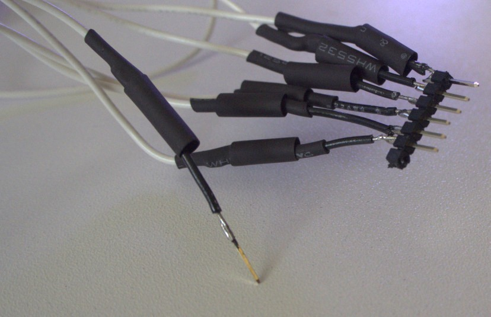

# Florence Player Build Instructions
*by the [Florence Project](https://itee.uq.edu.au/florence)*
<figure markdown>

<figcaption>The Florence Player</figcaption>
</figure>
## Aim
We aimed to create a music player that people with dementia would find simple to use and that would be suitable for families or Men's Sheds to construct. 
The player would have a backend accessible by web browser over the local network to easily assign playlists or internet radio streams to station buttons.
This would allow people living with dementia and their families and care partners to easily individualise the music and content.
We also wanted the possibility to customise the form of the player in a familiar or recognisable way which could differ from person to person.
We wanted the potential to connect to a smart-home system later and to have the option to collect data about how and when the player was being used.
We also wanted two peripherals: one to play albums using RFID tags, and the other was to be a grid of albums with an associated switch to play each album.
We would prioritise free and open source software and hardware, and release our modifications under such a licence.

## Rationale

[In a systematic review ](https://onlinelibrary.wiley.com/doi/epdf/10.1111/ajag.12642)of 4 studies on the effects of individualised music listening, Gaviola et al concluded that the evidence, though limited, suggested positive impacts on agitation, anxiety, depression, and emotion. The authors also noted that the outcomes were favourable compared to more resource-intensive interventions.

However, beyond these measurable aspects, [Dowson et al](https://doi.org/10.1016/j.maturitas.2019.06.001) write:
>People with dementia and their carers suggest that the key characteristics of music for them are that it facilitates social interaction, helps to maintain relationships, reinforces their sense of identity, remains meaningful and accessible through all stages of dementia, and that overall it supports the wellbeing of both people with dementia and those involved in their care.

In a [2006 paper](https://www.cambridge.org/core/journals/ageing-and-society/article/music-and-the-wellbeing-of-people-with-dementia/39487B281F93E554DF8ACC6DD3842579) Sixsmith and Gibson determine that the main difficulty encountering music include recognising the device, remembering the enjoyment of music, choice of music and using the device. One of the ways the Florence Player may assist most is through the choice of music. When turned on, it plays a pre-programmed station and affords the choice of three others that are programmable by a web UI. This means the choice of music can be individualised by family and caregivers. As [this paper](https://www.tandfonline.com/doi/full/10.1080/2331186X.2017.1362888) by Johnston et al discusses, this may itself have beneficial impacts like the formation of positive new memories.

## Inspiration

While designing our radio we were inspired and influenced by a number of other projects.
We loved, and incorporated, the personalisation options of <a href="https://homelifetech.com.au/products/relish-radio">The Relish Radio</a>, the simplicity of the <a href="https://designability.org.uk/projects/products/simple-music-player/">Simple Music Player</a>, and the DIY nature of the <a href="https://hackaday.io/project/26096-dementia-friendly-music-player">Dementia-Friendly Music Player</a>.

## Notice
Links to suppliers are used for reference and this project receives no financial or other benefit from any retailer listed.

## Warranty
THE SOFTWARE IS PROVIDED "AS IS", WITHOUT WARRANTY OF ANY KIND, EXPRESS OR IMPLIED, INCLUDING BUT NOT LIMITED TO THE WARRANTIES OF MERCHANTABILITY, FITNESS FOR A PARTICULAR PURPOSE AND NONINFRINGEMENT. IN NO EVENT SHALL THE AUTHORS OR COPYRIGHT HOLDERS BE LIABLE FOR ANY CLAIM, DAMAGES OR OTHER LIABILITY, WHETHER IN AN ACTION OF CONTRACT, TORT OR OTHERWISE, ARISING FROM, OUT OF OR IN CONNECTION WITH THE SOFTWARE OR THE USE OR OTHER DEALINGS IN  THE SOFTWARE.

## Parts list

- 1 x Raspberry Pi 3B or 3B+, USB cable, and power pack
- 2 x <a href="https://www.adafruit.com/product/1314">Speaker 3" Diameter, 4 Ohm, 3 Watt</a>
- 1 x <a href="https://www.adafruit.com/product/3346">Adafruit I2S 3 Watt Stereo Speaker Bonnet for Raspberry Pi</a>
- 1 x <a href="https://www.adafruit.com/product/3393">Panel Mount 10K Dual Linear Potentiometer with On/Off Switch</a>
- 1 x <a href="https://core-electronics.com.au/black-metal-knob-14x24mm.html">Black Metal Knob for 0.25" shaft</a>
- 1 x <a href="https://www.adafruit.com/product/856">MCP3008 - 8-Channel 10-Bit ADC With SPI Interface</a>
- 1 x <a href="https://core-electronics.com.au/led-rgb-diffused-common-anode.html">RGB Diffused LED</a>
- 2 x 2000 Ohm resistor
- 1 x <a href="https://www.altronics.com.au/p/p5430-oupiin-40-way-header-pin/">40 pin headers, pin</a>
- 2 x <a href="https://www.altronics.com.au/p/p5390-oupiin-40-pin-header-socket/">40 pin headers, socket</a>
- 1 x <a href="https://core-electronics.com.au/solderless-breadboard-300-tie-points-zy-60.html">Solderless breadboard for prototyping</a>
- 8 x <a href="https://core-electronics.com.au/machine-screw-m3-10mm-length-phillips-25-pack.html">Machine Screw M3, 10mm length Philips</a>
- 8 x <a href="https://core-electronics.com.au/machine-hex-nut-m3-25-pack.html">Machine Hex Nut M3</a>
- 1 x <a href="https://www.altronics.com.au/p/h8945-raspberry-pi-mounting-hardware-kit/">Raspberry Pi Mounting kit</a>
- 7 x <a href="https://www.altronics.com.au/p/s3255-spdt-momentary-solder-tail-push-button-microswitch/">S3255 SPDT Momentary Push Button Microswitch</a>
- 4 x <a href="https://magnet.com.au/products/ferrite-disc-magnet-9-5mm-x-3mm?_atid=yoAZS1xoT68WpLOeGjgUGcbRDviEzy">9.5mm diameter by 3mm height ferrite disk magnets</a>
- 4 x <a href="https://magnet.com.au/products/neodymium-disc-6mm-x-3mm">6mm diameter by 3mm rare earth magnet</a>
- 1 x self-mixing epoxy
- <a href="https://www.altronics.com.au/p/w0912a-black-3mm-heatshrink-1.2m-length/">Heat Shrink Tubing 1.2m length</a> 3mm pre-shrunk, 1.5mm shrunk
- <a href="https://core-electronics.com.au/hook-up-stranded-wire-white-22-awg.html">Hook-up stranded wire (22 AWG)</a>
- <a href="https://core-electronics.com.au/hook-up-wire-black-22-awg.html">Hook-up standard solid wire (22 AWG)</a>
- 1 x <a href="https://www.altronics.com.au/p/h0714-75-x-100mm-0.1-inch-pitch-vero-board-pcb/">75 by 100mm 0.1" Pitch Vero Board PCB Stripboard</a>
- Solder

### Tools

- Soldering Iron
- Drill and 2mm drill bit
- Screwdriver
- 400 grit sandpaper
- IC extractor

## Design
### Hardware
#### Case

Our first version was a 3D printed case with a single affordance: a clicky on/off switch and volume knob.
<figure markdown>

<figcaption>Our first version</figcaption>
</figure>
In this version we wanted to include more options, especially the ability to skip tracks.
However, since dementia is a progressive illness and over time someone with dementia might find it too difficult to use certain features that they could previously, we also wanted the case to be able to simplify over time.
We cut and etched an extra piece of wood so that if the play/pause/skip buttons became confusing the switches could be removed and this wood piece secured on top of the holes where the switches were.
Alternatively, if the stations were too complex a larger piece could be laser cut to cover this section.
This means that the overall design remains mostly the same but that any confusing elements can be simplified over time.

<figure markdown>
{width="400"}
<figcaption>Covering the switches with a wood piece</figcaption>
</figure>

As some people living with dementia have reduced dexterity in their hands, we chose that can be individually pressed with a knuckle.

##### Laser-cutting

We were working on this player during a lockdown and had no physical access to a laser cutter.
Instead we opted to make a schematic and have it professionally laser cut.

We used the **boxes.py** generator for an <a href="https://www.festi.info/boxes.py/ElectronicsBox?language=en">electronics box</a> with the following settings:
<figure markdown>
{ width="600"}
<figcaption>The settings for the electronics box on boxes.py</figcaption>
</figure>

Your settings will depend on the thickness of your wood.[^11]

We then used <a href="https://inkscape.org">Inkscape</a> to add in the cutouts for the components and for the etching.
Our final version can be found in the [schematics directory](https://github.com/uq-flor-pro/florence-player/tree/main/schematics) of the repository.

### Software
For this project we use <a href="https://mopidy.com/">Mopidy</a> and base our player code on the <a href="https://github.com/confirm/mopidy-pummeluff">Mopidy Pummeluff</a> extension.
Mopidy is an extensible music server written in Python and Mopidy Pummeluff is an extension for playing music by reading identification data from RFID tags.
We chose Mopidy Pummeluff as it had a number of features:

- the ability to read UIDs from RFID tags
- a web interface to add RFID tag UIDs to a registry
- could be modified to incorporate our changes
- was licensed under an appropriate licence

One change we wanted to make was to use a 'clicky' on/off potentiometer instead of a rotary encoder for the volume as the on/off switch is a familiar affordance and a potentiometer provides accurate visual and tactile feedback (though the mark on the knob we have used is unfortunately quite small and potentially hard to read).
To make this change meant using an Analog to Digital Converter (ADC) to connect to the potentiometer as the GPIO pins on the Pi are digital.
The ADC we chose connects via Serial Peripheral Interface (SPI), as does the RFID reader.[^9]
We tried to get the RFID and ADC both working simultaneously with one using hardware SPI and the other software SPI. Unfortunately we couldn't and decided to focus on getting the base player working and try again later to incorporate RFID reading.

#### Our software changes

##### Registry

Rather than create a new registry format for stations, we decided it would be better to modify the RFID tag format to allow for the stations. To keep RFID tags a possibility later, we modified the registry slightly so that a tag would by default be considered an RFID tag, but if this argument was false it would be handled as a station instead. This meant the Pummeluff web page and Tornado web backend could also be modified rather simply.

##### Web interface

To change the web interface we added a new form for setting stations. This communicates with a modified `web.py` backend to handle setting stations and aliases. Aliases are convenient names for naming stations. 
<figure markdown>
{ width="450"}
    <figcaption>The form for assigning a tracklist to station 1</figcaption>
</figure>

##### Drag and drop/file upload
We also added the ability to send files to the player via the web interface.
<figure markdown>
{ width="450"}
    <figcaption>The form (as seen on desktop) for sending files to the player</figcaption>
</figure>
<figure markdown>
{ width="450"}
    <figcaption>The form (as seen on mobile) for sending a file to the player</figcaption>
</figure>
This was useful after Spotify deprecated the API that the Mopidy-Spotify extension uses. Until a workaround is found for that we can still easily send audio to the player this way.

##### Stations
We added a separate module containing a Station class and four subclasses representing the four station buttons.

## Build

### Assemble Speaker Bonnet
Assemble the speaker Bonnet <a href="https://learn.adafruit.com/adafruit-speaker-bonnet-for-raspberry-pi/assembly">as per Adafruit's instructions</a>. This involves soldering the headers and speaker terminal blocks.

### RaspberryPi OS

We need to install the latest version of the Lite RaspberryPi OS (previously known as Raspbian).
<a href="https://randomnerdtutorials.com/installing-raspbian-lite-enabling-and-connecting-with-ssh/">This tutorial from Random Nerd Tutorials</a> explains the steps involved to flash the image to a microSD card with wireless credentials and SSH enabled.
Make sure to change the default password in step 2.9.

Turn on the Pi and check we can see and connect to the Pi without knowing its IP address by running the following command to SSH in. See instructions for Windows [here](https://mediatemple.net/community/products/dv/204404604/connect-to-ssh-using-putty-(windows)).
``` bash
ssh pi@raspberrypi.local 
```
or, if ssh tries to use ssh keys:
```bash 
ssh pi@raspberrypi.local -o IdentitiesOnly=yes
```
If you get the result `ssh: Could not resolve hostname raspberrypi.local: Name or service not known` then try the following section. If you see a login prompt then log into the Pi using the credentials you set and then skip the next section.

#### (optional) If your Raspberry Pi is not accessible via raspberrypi.local
In this case we need the ip of our device to log in via SSH.
There are a few ways to get this.
One way is to login to your router and look for the Raspberry Pi's connection.
Otherwise <a href="https://raspberrypi.stackexchange.com/questions/13936/find-raspberry-pi-address-on-local-network">this page</a> has a number of alternatives.

One you have the IP address we can ssh into the Pi.
From there install avahi-daemon as shown in <a href="https://www.howtogeek.com/167190/how-and-why-to-assign-the-.local-domain-to-your-raspberry-pi/">this article</a>.
From now on we can access our Pi via this address rather than the IP address.
This will be useful to access the station management backend from different devices[^15].


### Update the OS

Check for updates and install any
``` bash
sudo apt update
sudo apt upgrade
```
!!! warning
    Practise good security by keeping your Pi operating system up-to-date by regularly checking for updates, changing the default password, and exercising caution when running scripts and commands from untrusted sources.
   
### Set up speakers

In this step we wire up the speakers and connect them to the terminal blocks of the Bonnet.

1. Cut the stranded wire to length to about 20cm
2. Strip all the ends of the wires
3. Twist and tin each end
4. Solder one end to the speakers as in the video
5. Attach other end to terminal blocks of the Speaker Bonnet

The first half of [this video](assets/https://www.youtube.com/watch?v=8UXloSxQlEA) shows the method we used. We can ignore the second half of the video as we are not attaching the speakers to a breadboard but to the Speaker Bonnet's terminal blocks.
    
### Install Speaker Bonnet 

In our experience installing the Speaker Bonnet needs to be performed early to avoid issues later on.
The instructions are <a href="https://learn.adafruit.com/adafruit-speaker-Bonnet-for-raspberry-pi/raspberry-pi-usage">on the Adafruit website</a>.
If you see a big red warning on that page regarding the Full version don't panic, we are using the Lite version of the RaspberryPi OS.

The installer will offer to test the speakers. If this test isn't successful, check the soldering of the Bonnet, or of the speaker, or reinstall the Bonnet software.

### Breadboarding
<figure markdown>
{ width="450"}
<figcaption>The breadboard schematic</figcaption>
</figure>
Next we build the player on a breadboard and check everything works.

#### Tin the components
Tin the switches, the LED pins, and the potentiometer (including on/off switch) to make them easier to solder.
To tin the switches, we heat up the normally open (NO) tabs of the switches and touch the solder to the heated component to flow some solder on, then do the same for the common (C) tab.[^7]
To tin the LED, the potentiometer, and the on/off switch we heat the wire and touch the solder to the heated wires to flow solder on.
The potentiometer pins we use are the first three (shown in red in the next diagram) and the on/off switch (shown in blue) are the pair of pins at the end.
<figure markdown>
{ width="450"}
<figcaption>The red pins are the potentiometer we use and the blue for the on/off switch</figcaption>
</figure>

#### Wires
We use multi-stranded wire for most of the wire so that flexing it doesn't break the only thread. For mounting to the breadboard and later inserting into the header sockets it will be easier to have single wire ends. We do this for one end of the following wires:

- 7 pairs for the switch leads
- 1 pair for the LED 
- 5 wires total for the potentiometer and on/off switch combination

The other end gets connected to the component.

<figure markdown>

<figcaption>One switch down, six to go</figcaption>
</figure>

We add heatshrink to each to help prevent short-circuits occuring. First, cut the heatshrink, slide it over, then solder, and finally using a lighter or heat gun to shrink the heatshrink. <a href="https://youtu.be/6rmErwU5E-k?t=439">This video</a> demonstrates the whole process.

### Setup RaspberryPi OS and install the player

<a href="https://docs.mopidy.com/en/latest/installation/">Install Mopidy via their instructions</a>

!!! important
    Unfortunately, Spotify integration is currently not working due to Spotify deprecating the API libspotify communicates with. [This issue](https://github.com/mopidy/mopidy-spotify/issues/110) discusses resolving this situation.
    
Install espeak which will read the IP address using text to speech
``` bash
sudo apt install espeak
```
Install pip for Python package management, and the requirements for the Spotify extension
``` bash
git python3-pip libSpotify12 python3-Spotify
```
Install the Iris Mopidy web front end and the Spotify extension.
``` bash
sudo pip install mopidy-iris Mopidy-Spotify Mopidy-Local
```

Enable SPI in rasp-config [using this link if needed.](assets/https://www.raspberrypi-spy.co.uk/2014/08/enabling-the-spi-interface-on-the-raspberry-pi/)

Install the requirements for our player code
``` bash
sudo pip install spidev
```

Give Mopidy access to SPI and GPIO groups
``` bash
sudo usermod -a -G spi,gpio mopidy
```

Edit the Mopidy configuration and set Spotify credentials, local music location, etc. This will depend on your setup but an example configuration file is provided in the `other` directory.

``` bash
sudo nano /etc/mopidy/mopidy.conf
```

Create the folder for webuploads, and give all users the right to read and write.
``` bash
mkdir -p /home/pi/music/webuploads
chmod a+rw -R /home/pi/music/webuploads
```

Install our modified player code (be aware after running the first command you will be in a root shell. To exit press ctrl-d.)
``` bash
sudo su -
cd /usr/src
git clone https://github.com/uq-flor-pro/florence-player.git
cd florence-player
python setup.py install
```

Enable Mopidy to run at boot:
``` bash
sudo systemctl enable mopidy.service 
```
Start the Mopidy service now:
``` bash
sudo systemctl start mopidy.service
```

Edit the boot file:
``` bash
sudo vim /boot/config.txt
```

And add the following at the bottom to set the shutdown pin[^19] and enable the on LED:
```
[shutdown]
dtoverlay=gpio-shutdown,active_low=0

enable_uart=1
```

And save the file and reboot the Pi:
``` bash
sudo reboot
```

#### Access the configuration page

The web-server on the player is accessible via port 6680. 
Navigating to [http://raspberrypi.local:6680](http://raspberrypi.local:6680) with a browser on the same network will hopefully show the Mopidy page with links to Iris, Florence and Local.
Unfortunately acessing `raspberrypi.local` <a href="https://raspberrypi.stackexchange.com/questions/91154/raspberry-pis-local-hostname-doesnt-work-on-android-phones">does not work on Android phones</a> in which case we need the IP address to access this configuration file.
To have the player read this address press play and pause at the same time.
Then access the configuration page at that IP address: [http://192.168.xxx.xxx:6680](http://192.168.xxx.xxx:6680).
<figure markdown>

<figcaption>The Mopidy homepage</figurecaption>
</figure>
From here we can create playlists with Iris and assign playlists to stations with Florence.

### Stripboard build
Once we've confirmed everything works with a breadboard, it's time to construct on the stripboard.
<figure markdown>
{ width="550"}
<figcaption>The stripboard schematic</figcaption>
</figure>

- Break the header pins into two 7 length pieces
- Quickly but carefully solder the switch wires to the header pins making sure the order on both is the same. We messed up twice but were happy with the third result. If this proves too difficult, skip the headers and mount the wire into the sockets directly.[^5]


<figure markdown>
{ width="550"}
<figcaption>The header pins are fragile: too much heat will melt the casing</figcaption>
</figure>

<figure markdown>
{ width="550"}
<figcaption>Not perfect but working. Next step is to shrink the heatshrink. We probably should have cut the single strand wire off and connected the headers to the stranded wire, in which case they might have soldered better.</figcaption>
</figure>

- Remove the IC from the breadboard using an IC extractor
- Cut header sockets into 8, 8, 7, 7, 7, 6, 4, 1, 1 lengths by counting out the number of sockets needed then removing the next pin with pliers, then cut the header sockets at the extracted pin[^4]
- Break the 15 highlighted strips on the stripboad: the 7 length section for the station switches and 8 length section for the MCP3008. These are the gaps in the channels in the following schematic. We did this by carefully cutting with a craft knife but there are other methods[^12]


<figure markdown>
{ width="450"}
<figcaption>The 15 strips to cut</figcaption>
</figure>
   
   
- Solder the components one by one
- Cut wire to length and solder it


<figure markdown>
{ width="450"}
<figcaption>The soldered board. Note, this board uses a 2 socket header — not a single socket — on the top right but is otherwise based on the schematic.</figcaption>
</figure>


<figure markdown>
{ width="450"}
<figcaption>Rear view (mirrored left-right)</figcaption>
</figure>

- Check the connections[^3]

### Construction

#### Mount the Pi

The mounting holes on the Pi 3B/3B+ form a rectangle 58mm wide by 49mm high[^13].
Mount the Pi so the top is just below the cutouts that will hold the triangles for the shelves.
Account for the extra room taken up by the Speaker Bonnet and make sure to account for the extra distance taken up by the power cable at the bottom.[^17]

!!! important
    Check what cables need to be connected before assembling. In our case the micro USB cable can't be connected after assembling.

Drill holes for the standoffs, then screw the standoffs in and mount the Pi. 

<figure markdown>

<figcaption>Mounting the Pi to the backplate</figcaption>
</figure>

#### Mount the speakers and potentiometer

Screw the speakers in using four M3 screws and nuts.
Mount the potentiometer in the front case and tighten with its nut.

<figure markdown>

<figcaption>The potentiometer in the casing</figcaption>
</figure>

#### Sanding

Sand the triangle tabs so that they fit nicely into the holes.
Be gentle with them if they fit tightly as they might snap off, as we found out first hand :(.
<figure markdown>

<figcaption>A broken tab</figcaption>
</figure>

We had cut some extra lengths in case we needed to reinforce any corners and because there was extra room in the timber sheet we had laser-cut.
These pieces came in handy and we used one here as a cross-piece.

<figure markdown>
{width="400"}
<figcaption>Improvised cross-piece</figcaption>
</figure>

We also found we needed to sand in between the tabs of the side pieces to get a good fit[^18].
We wrapped another piece, 13cm by 8mm, in 400 grit sandpaper to form a nice tool for this.

#### Gluing up
When it was time to glue we used the method in <a href="https://www.youtube.com/watch?v=oSs3zhVkcTc">this video</a>.

#### Magnetic closing
Glue the ferrite magnets in the corner of the triangular shelves.
<figure markdown>
{width="400"}
<figcaption>
Gluing the ferrite magnets.
</figcaption>
</figure>
Then glue the rare-earth magnets to the corners of the top piece, setting them inside by 1.5mm each way, checking the polarities are correct.
<figure markdown>
{width="400"}
<figcaption>One of the rare-earth magnets.</figcaption>
</figure>
Leave to set.


### Configure the switches
Watch the logs with:
```bash
sudo journalctl -fe
```
This command will continue running until we press Ctrl-C to interrupt it.

One by one we press the switches making note of which GPIO pin is reported to be attached in the logs.
We are looking for a line like:
```bash
INFO     [Dummy-19] mopidy_florence_player.threads.gpio_handler Button at pin 20 was pushed
```
This means the functionality will need to be assigned to pin 20.
In `mopidy_florence_player/threads/gpio_handler.py` we set up the `button_pins` dictionary with the values we got. Eg,
```python 
button_pins = {
    16: Play,
    13: Pause,
    23: NextTrack,
    20: PlayStationOne,
    6: PlayStationTwo,
    5: PlayStationThree,
    22: PlayStationFour,
}
```
The dictionary you use will depend on the order the switches were placed.

### Upload some audio and set up some stations
Navigate to `raspberrypi.local:6680/florence/` (or use the IP address if that URL doesn't work).
Here we can upload mp3, wav, or flac format songs, or alternatively a zip file of songs.
From these audio we can make a tracklist and assign it to a station switch.

We can also assign internet radio stations to the station switches.
[See here](https://help.abc.net.au/hc/en-us/articles/4402927208079-Where-can-I-find-direct-stream-URLs-for-ABC-Radio-stations-) for a list of ABC streaming links.

#### Creating a playlist
[Playlist for life](https://www.playlistforlife.org.uk/) has some tips and potential pitfalls in creating playlists for/with people living with dementia.
[BBC Music Memories](https://musicmemories.bbcrewind.co.uk/home) has some ideas for songs based on type (popular, theme-song, classical, UK Nations, international, social), genre, and era.

#### Label the stations

For this step either glue on a [small piece of whiteboard](https://core-electronics.com.au/flexible-magnetic-dry-erase-whiteboard-21cm-x-15cm.html), or Blu-Tak an index card cut to size.

<figure markdown>
{width="400"}
<figcaption>Labelling the stations</figcaption>
</figure>

## Future Work
One downside with the Raspberry Pi is that it can take upwards of 30 seconds, and sometimes a minute, for the player to start playing. One idea we would like to try is to install a noise generating circuit that started playing when the radio was turned on and was turned off by the player when it had booted completely.

We didn't get to include RFID capabilities, nor build the peripheral with a grid of albums each with a dedicated switch. We might add these later.

## Mistakes
Here's a few of the mistakes we made in building the player.

### The corners of the player are sharp
And maybe a bit dangerous for some people.

### Stealing one of the Speaker Bonnet's I2S pin to use as a station switch
We were wondering why audio was working without the extension but not when it was running, and the gstreamer output worked but the player didn't.
It turned out that one of the station pins had been set up to use one of the I2S pins that the Pi uses to communicate with the Speaker Bonnet.
The Speaker Bonnet exposes this pin even though it's in use by the Bonnet.
Changing this to a free pin restored audio.

### The pi-rc522 library that Pummeluff uses needs the pinmode set to Board

[The pins](https://pinout.xyz/) on a Raspberry Pi can be referenced numerically in multiple ways.
This is known as pinmode.
To use the RFID reading capabilities of Pummeluff at the same time, it is necessary to change the pinmode to Board from BCM in the gpio_handler and mcp_watcher files to avoid errors caused by conflicting modes.[^16]
Since we aren't using this the RFID reader at the moment, we have commented out the sections where this ```tag_reader``` gets called and used BCM mode.

## Notes
### Speaker Bonnet

We had some issues getting the Speaker Bonnet set up originally.
Adafruit's debugging suggestions generally involve reflashing the OS, reinstalling the Speaker Bonnet code, and checking soldering which can be frustrating, but the first is one of the reasons we install the speaker so early in the process now: this way if we need to reinstall there's less to do.

### Wireless drops out under load

When connected using wifi and performing updates or transferring files using ```scp```, we often found the network connection would drop out for a few minutes.
[This link](https://forums.raspberrypi.com/viewtopic.php?p=1670096&hilit=transfer+disconnects#p1670096) seems to refer to the issue.
Throttling the connection using wondershaper didn't seem to help and this only happened over wifi.
We ended up using a USB wireless adapter instead of the inbuild wifi adapter.
See [this Github issue](https://github.com/uq-flor-pro/florence-player/issues/1) on the Florence Player repository for more information.

### Tornado is limited to 100Mb files when uploading
We tried to increase the `max_body_size` when starting the Tornado HTTPServer in Mopidy.
Unfortunately sending a 300Mb zip crashed Mopidy as it used too much RAM.
As a result we leave the 100Mb size restriction in place.

[^1]: In building our prototype we had to do this a few times and still didn't get it perfect. However we think it's worth doing as it makes the final version much cleaner and easier to work with.

[^5]: The plastic frame on the headers will easily melt if we linger on a pin too long. To solder, we used this method <a href="https://www.youtube.com/watch?v=IkjMK26ROcM">https://www.youtube.com/watch?v=IkjMK26ROcM</a>

[^3]: We checked each joint with a multimeter and also tested portions of the board we know should be connected. There should be a 0 Ohm potential between any two connected points, and a large resistance between unconnected points.

[^4]: Wirecutters work well.

[^7]: <a href="https://www.youtube.com/watch?v=pf_Mngbx32w">https://www.youtube.com/watch?v=pf_Mngbx32w</a> is a good example of this, soldering a similar component to the switches we used.

[^8]: <a href="https://www.festi.info/boxes.py/ElectronicsBox?language=en">https://www.festi.info/boxes.py/ElectronicsBox?language=en</a>

[^9]: We originally chose an ADC that used SPI instead of I2C because we wanted to keep GPIO 3 free. This is because pin 3 can be used to start up the Pi from the shutdown state by connecting it to ground. We also want to shut the Pi down using a GPIO signal but didn't realise until later that the Pi can be shutdown by other GPIO pins by specifying them in /boot/config.txt. See <a href="https://github.com/raspberrypi/firmware/blob/master/boot/overlays/README">this file</a> in the section named gpio-shutdown for details. Since it is possible to specify this other pin for shutdown, using a I2C ADC might work well as it would free up the hardware SPI for the RFID reader.

[^11]: If you use this generator with a thick Piece of wood and the tabs on the triangles disappear you might need to increase the *triangle* measurement to compensate.

[^12]: <a href="https://electronics.stackexchange.com/questions/94659/how-to-cut-the-tracks-of-a-stripboard">https://electronics.stackexchange.com/questions/94659/how-to-cut-the-tracks-of-a-stripboard</a>

[^13]: <a href="https://datasheets.raspberrypi.com/rpi3/raspberry-pi-3-b-plus-mechanical-drawing.pdf">https://datasheets.raspberrypi.com/rpi3/raspberry-pi-3-b-plus-mechanical-drawing.pdf</a>

[^15]: Alternatively we can set up a static ip on the player but this is not perfect as another device might take the player's lease, perhaps while the player is off.

[^16]: <a href="https://github.com/adafruit/Adafruit_Python_Extended_Bus/issues/2">See this bug report for more</a>

[^17]: We placed our Pi too low and needed to use a right-angle usb cord so as to fit in the gap between the bottom of the Pi and the bottom plate.

[^18]: There is a burn variable in festi-boxes that can help with the fit, but will require a few test cuts on your laser-cutter.

[^19]: [Explanation here](https://gist.github.com/lbussy/9e81cbcc617952f1250e353bd42e7775)
